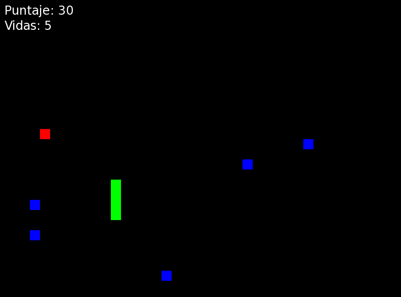
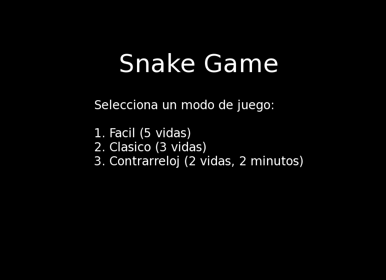
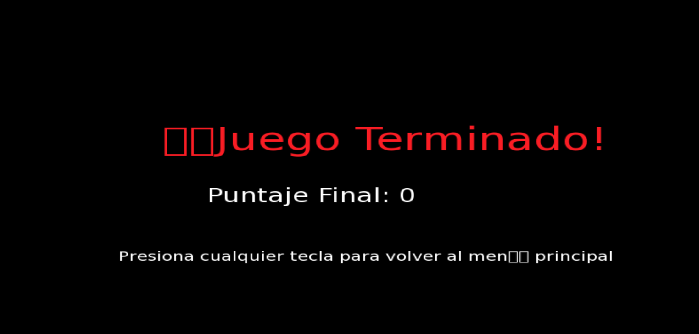

# SnakeGame

## Descripción

**SnakeGame** es una versión mejorada del clásico juego de Snake, desarrollada en C++ utilizando la biblioteca [SFML (Simple and Fast Multimedia Library)](https://www.sfml-dev.org/)

### Características Principales

- **Marcador de Vidas:** Muestra el número de vidas restantes. Pierdes una vida al colisionar con obstáculos o contigo mismo.
- **Obstáculos Aleatorios:** Obstáculos estáticos generados aleatoriamente que la serpiente debe evitar.
- **Modos de Juego Variados:**
  - **Fácil:** 5 vidas.
  - **Clásico:** 3 vidas.
  - **Contrarreloj:** 2 vidas y un límite de tiempo de 2 minutos.
- **Sistema de Menús:** Pantalla de inicio con opciones de selección de modo de juego.
- **HUD Informativo:** Muestra puntaje actual, vidas restantes y tiempo (en modo contrarreloj).
- **Animaciones y Transiciones Suaves:** Transiciones al iniciar el juego, al comer comida y efectos al finalizar.
- **Controles Personalizados:** Soporte para teclas de flechas y WASD para el movimiento de la serpiente.
- **Reinicio de Juego:** Opción para reiniciar el juego y volver al menú principal tras finalizar.

## Capturas de Pantalla

*Menú principal del juego.*

*Pantalla de fin de juego con opción de reiniciar.*

## Tecnologías Utilizadas

- **Lenguaje de Programación:** C++
- **Biblioteca Gráfica:** SFML
- **Sistema Operativo:** Ubuntu 20.04

## Requisitos

- **Compilador C++** compatible con C++11 o superior (por ejemplo, `g++`).
- **SFML** instalada en tu sistema.

### Clonar el Repositorio
    git clone https://github.com/moises60/SnakeGame.git
### Acceder a la carpeta     
  cd SnakeGame
### Compilar el Proyecto
    make
### Ejecutar el Juego
    ./bin/SnakeGame
### Limpiar Archivos Compilados
    make clean

